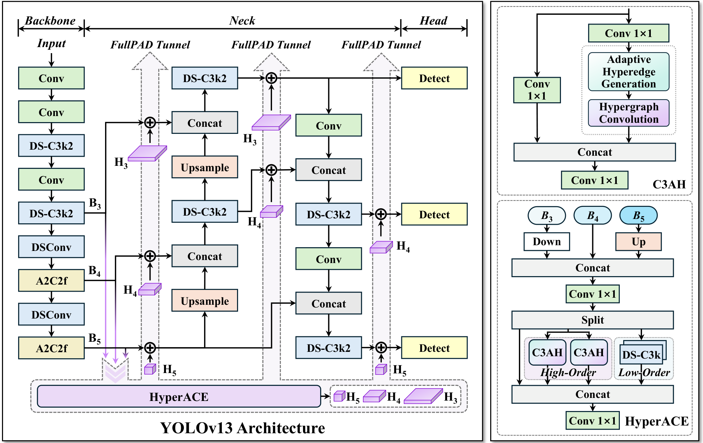
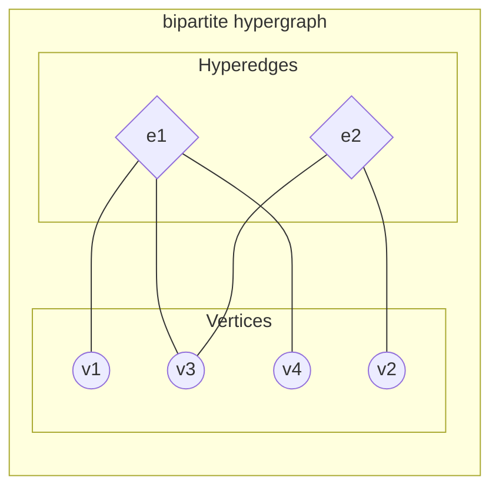
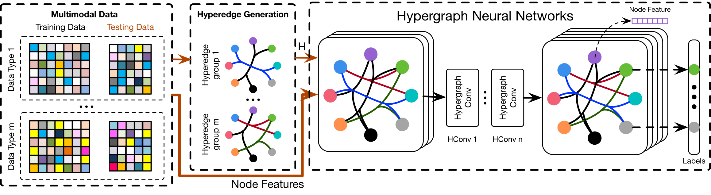
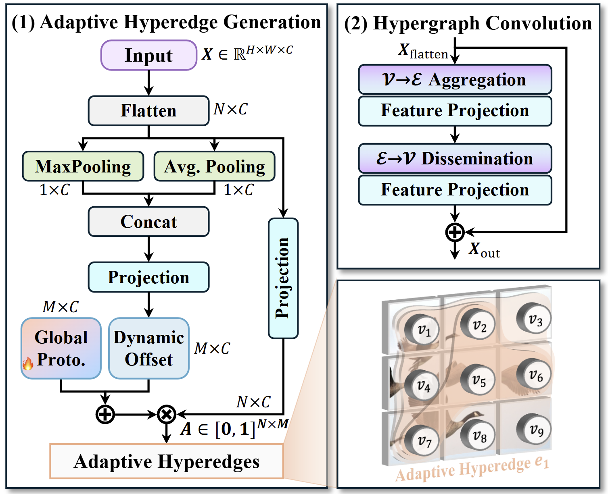

# YOLOv13: Real-Time Object Detection with Hypergraph-Enhanced Adaptive Visual Perception

---

## 0. Metadata
- **Full Title**: YOLOv13: Real-Time Object Detection with Hypergraph-Enhanced Adaptive Visual Perception
- **Authors**: Mengqi Lei; Siqi Li; Yihong Wu; Han Hu; You Zhou; Xinhu Zheng; Guiguang Ding; Shaoyi Du; Zongze Wu; Yue Gao
- **Venue / Year**: arXiv (likely 2025)
- **Links**: [Code](https://github.com/iMoonLab/yolov13) | ArXiv: https://arxiv.org/abs/2506.17733
- **Keywords**: YOLO, object detection, hypergraph, high‑order correlations, efficiency
- **Paper ID (short handle)**: YOLOv13

## 1. TL;DR (3–5 bullets)
- **Problem**: Prior YOLOs capture local or pairwise relations; miss global many‑to‑many correlations.
- **Idea**: HyperACE — adaptive hypergraph message passing to model high‑order cross‑location/scale relations.
- **System**: FullPAD — distribute correlation‑enhanced features across backbone, neck, head for synergy.
- **Efficiency**: Replace large‑kernel convs with depthwise separable designs to cut FLOPs/params.
- **Result**: SOTA mAP on MS COCO with fewer FLOPs; e.g., +3.0 mAP over YOLO11‑N, +1.5 over YOLOv12‑N (paper).

## 2. Problem & Motivation
Convolution and area self‑attention aggregate locally or pairwise, struggling in complex scenes with high‑order relations among multiple regions and scales.

### 2.1 Why previous YOLOs are not enough
- **Local aggregation (CNNs)**: Convolutions aggregate locally and are bounded by receptive field.
  > "Convolutional operations inherently perform local information aggregation within a fixed receptive field. Thus, the modeling capacity is constrained by the kernel size and network depth." (Introduction; paper-soruce/yolo13/sections/2_introduction.tex)

- **Pairwise limitation (self‑attention)**: Self‑attention models pairwise relations, not many‑to‑many.
  > "[T]he self-attention mechanism can be regarded as the modeling of pairwise pixel correlations on a fully-connected semantic graph, which inherently limits its capacity to capturing only binary correlations and prevents it from representing and aggregating multi-to-multi high-order correlations." (Introduction; paper-soruce/yolo13/sections/2_introduction.tex)

- **Global perception gap**: Area‑based attention compromises global perception due to cost.
  > "Although the self-attention mechanism extends the receptive field, its high computational cost necessitates the use of local area-based computation as a trade-off, thereby preventing adequate global perception and modeling." (Introduction; paper-soruce/yolo13/sections/2_introduction.tex)

- **High‑order correlation gap**: Prior designs miss global multi‑to‑multi correlations.
  > "[B]oth the convolutional architectures of YOLO11 and earlier versions and the area-based self-attention mechanism introduced in YOLOv12 are limited to local information aggregation and pairwise correlation modeling, lacking the capability to capture global multi-to-multi high-order correlations, which limits detection performance in complex scenarios." (Abstract; paper-soruce/yolo13/sections/1_abstract.tex)

### 2.2 How YOLOv13 addresses these issues
- **HyperACE (adaptive high‑order modeling)**: Learns soft hyperedges and performs linear‑complexity message passing to capture many‑to‑many, cross‑scale correlations; also integrates low‑order cues.
  > "[W]e propose a novel Hypergraph-based Adaptive Correlation Enhancement mechanism, named HyperACE… adopts a learnable hyperedge construction module to adaptively explore high-order correlations… Then, a message-passing module with linear complexity is leveraged… In addition, low-order correlation modeling is also integrated in HyperACE…" (Introduction; paper-soruce/yolo13/sections/2_introduction.tex)

- **FullPAD (full‑pipeline redistribution)**: Aggregates with HyperACE and redistributes enhanced features across backbone, neck, and head to improve information flow and gradient propagation.
  > "[A] Full‑Pipeline Aggregation‑and‑Distribution paradigm, named FullPAD… aggregates multi-level features… and then distributes the correlation-enhanced features to the backbone, neck, and detection head to achieve fine‑grained information flow and representational synergy… which significantly improves the gradient propagation…" (Introduction; paper-soruce/yolo13/sections/2_introduction.tex)

## 3. Method Overview
Backbone features are lifted to a hypergraph space where nodes (locations/scales) connect via adaptive soft hyperedges. HyperACE aggregates many‑to‑many messages to enhance features, which FullPAD distributes back through backbone/neck/head, enabling end‑to‑end training.

### 3.1 FullPAD
- **Goal**: Achieve fine‑grained information flow and representation synergy across the pipeline.
- **Mechanism**: Aggregate multi‑level backbone features via HyperACE; redistribute enhanced features to backbone, neck, and head; improve gradient propagation.
  > "FullPAD… aggregates multi‑level features… and then distributes the correlation‑enhanced features to the backbone, neck, and detection head… which significantly improves the gradient propagation." (Introduction; paper-soruce/yolo13/sections/2_introduction.tex)

**Figure 2 — Network Architecture**

> "The network architecture of our proposed YOLOv13 model. Taking multi-scale features extracted from the backbone as input, HyperACE adaptively explores high-order correlations and achieves feature enhancement and fusion. Then, the correlation-enhanced features are distributed to the entire network by FullPAD tunnels to achieve accurate object detection in complex scenes." (paper-soruce/yolo13/sections/figs/fig3-pipeline.tex)

- What “FuseModule” is in the figure: the entry stage of HyperACE that aligns and mixes three pyramid features (e.g., P3/P4/P5). It downsamples the higher‑resolution stream, upsamples the lower‑resolution stream, concatenates them with the middle stream (same scale), and applies a 1×1 conv to produce a single mid‑scale tensor for hypergraph processing.
  > "self.downsample = nn.AvgPool2d(kernel_size=2) … self.upsample = nn.Upsample(scale_factor=2) … x_cat = torch.cat([x1_ds, x[1], x3_up], dim=1) … conv_out = Conv(…, 1)" (FuseModule) (context/refcode/yolov13/ultralytics/nn/modules/block.py:1788–1810)
  - Pseudocode (shapes):
    ```python
    # Inputs: [x0, x1, x2] ~ [P3, P4, P5]   x0: (B,C,2H,2W), x1: (B,C,H,W), x2: (B,C,H/2,W/2)
    x1_ds = AvgPool2d(2)(x0)                # -> (B,C,H,W)
    x3_up = Upsample(scale_factor=2)(x2)    # -> (B,C,H,W)
    x_cat = cat([x1_ds, x1, x3_up], dim=1)  # -> (B,3C,H,W) (or 4C if channel_adjust)
    x_fused = Conv1x1(x_cat)                # -> (B,C,H,W)  # sent to HyperACE
    ```

**Network Modules**

- **DSConv**: Depthwise‑separable convolution (depthwise → pointwise), then BN + SiLU; lightweight primitive for feature extraction.
  > "The DSConv block first applies a standard depthwise separable convolutional layer to extract features, and then leverages batch normalization and SiLU activation to obtain the output…" (paper-soruce/yolo13/sections/4_methodology.tex)
  - Source: context/refcode/yolov13/ultralytics/nn/modules/conv.py:84
  ```mermaid
  flowchart LR
    subgraph DSConv["DSConv"]
      direction LR
      X([Input]) --> DW["Depthwise Conv (k,s,d)"] --> PW["Pointwise 1x1"] --> BN[BN] --> ACT[SiLU]
      ACT --> Y([Output])
    end
  ```

- **DS‑C3k2**: C3k2‑style block rebuilt with depthwise‑separable components; `1x1` unify → split to DS‑C3k path and direct path → concat → `1x1` fuse.
  > "The DS‑C3k2 block is derived from the C3k2 structure… features are split… one part fed into multiple DS‑C3k modules and the other passed through a shortcut… outputs are concatenated and fused with a 1×1 convolutional layer." (paper-soruce/yolo13/sections/4_methodology.tex)
  - Source: context/refcode/yolov13/ultralytics/nn/modules/block.py:1472
  ```mermaid
  flowchart LR
    %% DS-C3k2 diagram (horizontal)
    subgraph DS_C3k2["DS-C3k2"]
      direction LR
      X1([Input]) --> U1["1x1 Conv (unify)"]
      U1 --> A1["DS-C3k x n"]
      U1 --> CAT1[Concat]
      A1 --> CAT1
      CAT1 --> F1["1x1 Conv (fuse)"]
      F1 --> Y1([Output])
    end
  ```

- **DS‑C3k**: CSP‑C3 style block using DSBottleneck (DSConv‑based) internally; `1x1` reduce → main path `n`× DSBottleneck and lateral `1x1` → concat → `1x1` restore.
  > "The DS‑C3k block inherits from the standard CSP‑C3 structure… processed by n cascaded DS‑Bottleneck blocks… a lateral 1×1 convolutional branch… concatenated… and a 1×1 convolutional layer is leveraged to restore the feature channels." (paper-soruce/yolo13/sections/4_methodology.tex)
  - Source: context/refcode/yolov13/ultralytics/nn/modules/block.py:1414
  ```mermaid
  flowchart LR
    %% DS-C3k diagram (horizontal)
    subgraph DS_C3k["DS-C3k"]
      direction LR
      X0([Input]) --> R1["1x1 Conv (reduce)"]
      R1 --> MA["DSBottleneck x n"]
      R1 --> LB["1x1 Conv (lateral)"]
      MA --> CC[Concat]
      LB --> CC
      CC --> R2["1x1 Conv (restore)"]
      R2 --> Y0([Output])
    end
  ```

- **A2C2f**: Residual‑enhanced C2f with stacked ABlock (area‑attention) stages and ELAN‑style concatenation; 1x1 fuse to c2; optional residual add.
  > "A2C2f module with residual enhanced feature extraction using ABlock blocks with area‑attention. Also known as R‑ELAN… extends the C2f module by incorporating ABlock blocks for fast attention mechanisms and feature extraction." (context/refcode/yolov13/ultralytics/nn/modules/block.py)
  - Source: context/refcode/yolov13/ultralytics/nn/modules/block.py:1319
  ```mermaid
  flowchart LR
    %% A2C2f diagram (horizontal)
    subgraph A2C2f["A2C2f"]
      direction LR
      X2([Input]) --> CV1["1x1 Conv to c_hidden"]
      CV1 --> S1["2x ABlock"]
      S1 --> S2["repeat n stages"]
      %% Collect stage outputs for concatenation
      CV1 -.-> CAT2
      S1 --> CAT2
      S2 --> CAT2
      CAT2["Concat(y0..yn)"] --> CV2["1x1 Conv to c2"]
      %% Residual (if enabled)
      CV2 --> OUT2((out))
      X2 -.-> ADD2{"Add (x + gamma*out)"}
      OUT2 -.-> ADD2
      ADD2 --> Y2([Output])
    end
  ```

- **ABlock (Area‑Attention)**: Multi‑head area‑attention (partitioned spatial windows) + small Conv‑MLP, both with residual adds; adds 5x5 positional enhancement.
  > "ABlock class implementing a Area‑Attention block… applying multi‑head attention with feature map [areas] and feed‑forward…" (context/refcode/yolov13/ultralytics/nn/modules/block.py)
  - Source: context/refcode/yolov13/ultralytics/nn/modules/block.py:1268
  ```mermaid
  flowchart LR
    %% ABlock (Area-Attention) schematic
    subgraph ABlock["ABlock (Area-Attention)"]
      direction LR
      Xin(["x (B,C,H,W)"]) --> AA["AAttn: 1x1(q,k,v); areas; MHSA; +PE; 1x1 proj"]
      Xin -.-> SUM1
      AA --> SUM1["x + attn(x)"]
      SUM1 --> MLP["Conv1x1 -> Conv1x1 (MLP)"]
      SUM1 -.-> SUM2
      MLP --> SUM2["x + mlp(x)"]
      SUM2 --> Yout(["y (B,C,H,W)"])
    end
  ```

**Feature Fusion (H3, H4, H5)**
- **How fusion works (code)**: `FullPAD_Tunnel` implements a learnable gate on a residual add:
  > "computes `output = original + gate * enhanced`" (context/refcode/yolov13/ultralytics/nn/modules/block.py:1891)
  > "def forward(self, x):\n>     out = x[0] + self.gate * x[1]" (context/refcode/yolov13/ultralytics/nn/modules/block.py:1914)
- **Not concatenation**: FullPAD_Tunnel is additive, not concat. Concatenations are declared explicitly elsewhere (e.g., `Concat` nodes in the neck):
  > "- [[-1, 12], 1, Concat, [1]]" and similar (context/refcode/yolov13/ultralytics/cfg/models/v13/yolov13.yaml)
- **Pseudocode** (sketch):
  ```python
  # Inputs: backbone features B3, B4, B5 (e.g., indices 4,6,8)
  F = HyperACE([B3, B4, B5])          # enhanced base feature (mid scale)
  H3 = Upsample(F)                    # to B3’s scale
  H4 = F                              # same scale as B4
  H5 = DownsampleConv(F)              # to B5’s scale

  # Gated residual fusion (per FullPAD_Tunnel)
  B3_out = B3 + gate3 * H3
  B4_out = B4 + gate4 * H4
  B5_out = B5 + gate5 * H5
  ```
  - Gate is a learnable scalar (initialized at 0), enabling safe, gradual injection of HyperACE signals. (context/refcode/yolov13/ultralytics/nn/modules/block.py:1891)

### 3.2 HyperACE
- **Goal**: Model global multi‑to‑multi high‑order correlations across locations and scales.
- **Mechanism**: Learn soft hyperedges and perform linear‑complexity message passing; include low‑order correlations for completeness.
  > "HyperACE… adopts a learnable hyperedge construction module… a message‑passing module with linear complexity… [and] low‑order correlation modeling is also integrated…" (Introduction; paper-soruce/yolo13/sections/2_introduction.tex)


#### Hypergraph and its use in DNN
- **What is a hypergraph**: A hypergraph H=(V,E) generalizes graphs by allowing a hyperedge e∈E to connect any number of vertices (not just pairs). The relationships are encoded by an incidence matrix H∈R^{|V|×|E|} with H(v,e)=1 if v∈e, else 0.
  > "A hypergraph Gh can be represented by a |V|×|E| matrix H with entries h(v,e)=1 if v∈e and 0 otherwise. This is called the incidence matrix of Gh." (Hyperedge Modeling in Hypergraph Neural Networks, arXiv:2409.10340)

- **Why useful in DNNs**: Hyperedges model many‑to‑many relations (groups, contexts) beyond pairwise edges. Message passing can be defined from vertices→hyperedges and back (hypergraph convolution) guided by H and degree/weight matrices.
  > "We present a general framework for HGNNs… hypergraph message passing block aggregates information from neighbors to update … node features or hyperedge features." (Recent Advances in Hypergraph Neural Networks, arXiv 2025)

- **Two common formalisms**: (1) Star/bipartite expansion (introduce hyperedge nodes, pass messages on a bipartite graph), or (2) Direct vertex–hyperedge incidence operators (V→E→V) with learnable weights or attention.
  > "The incidence matrix … guides the message passing on the directed hypergraph." (Recent Advances in Hypergraph Neural Networks, arXiv 2025)

- **In YOLOv13 (HyperACE)**: Adapts this idea by learning soft participation degrees for vertices in each hyperedge and performing linear‑complexity message passing, then redistributing enhanced features via FullPAD.
  > "HyperACE … adaptively explores high‑order correlations … [with] message‑passing module with linear complexity …" (paper-soruce/yolo13/sections/2_introduction.tex)

**Visuals**




- Pseudocode (vertex→hyperedge→vertex message passing)
  ```python
  # X_v: (N, C) vertex features; H: (N, M) incidence; W_e: (M,) hyperedge weights
  # normalize degrees D_v, D_e as needed
  He = H.T @ X_v                 # aggregate vertices into hyperedges (V->E)
  He = He * W_e[:, None]         # hyperedge weighting / projection
  X_v_new = H @ He               # disseminate back to vertices (E->V)
  X_v = X_v + X_v_new            # residual update
  ```
  > See standard HGNN formulations using incidence matrices H, vertex/hyperedge degrees, and Laplacians. (e.g., Hypergraph Neural Networks, arXiv:1809.09401; Attention‑Based HGNN, Appl. Sci. 2024)

- HGNN pipeline (source: Hypergraph Neural Networks, arXiv:1809.09401)
  
  - Left: input nodes with features; hypergraph construction groups nodes into hyperedges (by heuristics, similarity, or learned rules), forming the incidence matrix H.
  - Middle: hypergraph convolutions perform two-step message passing V→E→V using H (and degrees/weights), often stacked for deeper reasoning; features update at nodes or hyperedges depending on the task.
  - Right: task head (e.g., node classification/segmentation) produces predictions; training backpropagates through construction (if learnable) and HGNN layers.
  > "It begins with hypergraph construction to initialize the hypergraph structure and features. Next, the hypergraph message passing block aggregates information … Then, task predictions are made …" (Recent Advances in Hypergraph Neural Networks, 2025)
  - About the colored edges: colors indicate different hyperedge groups/modalities constructed during hypergraph building. Each color corresponds to one group of nodes linked by a particular criterion (e.g., k‑NN in one feature space vs. another modality); these groups are concatenated/fused into the final incidence/adjacency.
    > "Multiple hyperedge structure groups are constructed from the complex correlation of the multi‑modality datasets. We concatenate the hyperedge groups to generate the hypergraph adjacent matrix H." (HGNN, arXiv:1809.09401, ‘Hypergraph neural networks analysis’)
    > "To generate the multi‑modality hypergraph adjacent matrix we concatenate adjacent matrix of two modality." (HGNN, arXiv:1809.09401, Figure 5 caption)
    - Example mapping (adjust to your dataset):
      - Blue: visual similarity (k‑NN over CNN features)
      - Orange: text similarity (k‑NN over bag‑of‑words/embeddings)
      - Green: social/temporal co‑occurrence (session/user grouping)
      - Purple: metadata proximity (e.g., category/tag match)
      These colored groups are built separately, then concatenated into a single incidence matrix H used by the HGNN layers.


#### Hypergraph in Yolo13 (HyperACE)
- **Inputs and vertices**: Fuse B3/B4/B5 to B4 scale → 1×1 conv → split to y0|y1|y2; take y1 on B4 grid and flatten to tokens (one per spatial location). (See `FuseModule` and `AdaHGComputation`.)
  ```mermaid
  %%{init: { "flowchart": { "htmlLabels": false, "useMaxWidth": true } } }%%
  flowchart LR
    %% HyperACE inputs: B3/B4/B5 -> y1 -> tokens
    subgraph HInputs["HyperACE Inputs"]
      direction LR
      B3["B3 (high-res)"] --> DS3["↓ to B4 size"]
      B5["B5 (low-res)"]  --> US5["↑ to B4 size"]
      B4["B4 (mid-res)"]  --> CAT
      DS3 --> CAT["Concat (C)"]
      US5 --> CAT
      CAT --> CV1["1×1 Conv"]
      CV1 --> CHK["Split channels: y0 | y1 | y2"]
      CHK --> Y1["`y1
      (mid chunk @ B4)`"]
      Y1 --> FLAT["`Flatten
      (B,C,H4,W4) -> (B,N,C)`"]
      FLAT --> TOK["tokens (vertices)"]
    end
  ```
- **Adaptive hyperedge construction (AdaHyperedgeGen + AdaHGConv)**: Given tokens `X ∈ R^{B×N×C}` (vertices), AdaHyperedgeGen builds context‑conditioned hyperedge prototypes and computes a multi‑head similarity between vertices and prototypes. A soft participation matrix `A ∈ R^{B×N×M}` is produced by normalizing over the vertex dimension (per hyperedge), i.e., for each hyperedge column `m`, the weights across all `N` nodes sum to 1. AdaHGConv then performs lightweight vertex→edge→vertex message passing with linear projections and a residual.

  
  > Details of the adaptive hypergraph construction and convolution.

  Mermaid overview:

  ```mermaid
  flowchart LR
    subgraph AdaHyperedgeGen
      direction LR
      X["X (B,N,C)"] --> CPool["Context pool (mean/max/both)"]
      CPool --> CNet["context_net: R^{C_ctx}→R^{M·C}"]
      PBase["prototype_base (M,C)"] --> POffs
      CNet --> POffs["prototype_offsets (B,M,C)"]
      POffs --> P["prototypes (B,M,C) = base + offs"]
      X --> PreHead["pre_head_proj (C→C)"] --> Split["split heads (h, d=C/h)"]
      P --> SplitP["split prototypes (h, d)"]
      Split --> SIM["similarity per head: bmm(X_h, P_h^T)/√d"]
      SplitP --> SIM
      SIM --> MeanH["mean over heads"] --> Drop["dropout"] --> SoftN["softmax over N"]
      SoftN --> A["A (B,N,M)"]
    end

    subgraph AdaHGConv
      direction LR
      A --> V2E["He = A^T · X  (B,M,C)"] --> EProj["edge_proj (Linear+GELU)"]
      EProj --> E2V["X' = A · He  (B,N,C)"] --> NProj["node_proj (Linear+GELU)"]
      X --> Res["residual add"]
      NProj --> Res
      Res --> Y["Y = X + NodeProj(A·EdgeProj(A^T·X))"]
    end
  ```

  Minimal pseudocode (matches implementation in `context/refcode/yolov13/ultralytics/nn/modules/block.py`):

  ```python
  # Inputs: X: (B, N, C), M hyperedges, h = num_heads, d = C // h
  # 1) Context-conditioned prototypes
  ctx = cat([X.mean(dim=1), X.max(dim=1).values], dim=-1)  # if context == 'both'
  proto_offs = context_net(ctx).view(B, M, C)              # (B, M, C)
  prototypes = prototype_base.unsqueeze(0) + proto_offs    # (B, M, C)

  # 2) Multi-head similarity and participation A
  Xh = pre_head_proj(X).view(B, N, h, d).transpose(1, 2)           # (B,h,N,d)
  Ph = prototypes.view(B, M, h, d).permute(0, 2, 1, 3)             # (B,h,M,d)
  logits_h = bmm(Xh.reshape(B*h, N, d), Ph.reshape(B*h, M, d).transpose(1, 2))
  logits = logits_h.view(B, h, N, M).mean(dim=1)                   # (B, N, M)
  A = softmax(dropout(logits), dim=1)                               # normalize across N (per hyperedge)

  # 3) Hypergraph convolution (V→E→V) with residual
  He = bmm(A.transpose(1, 2), X)                    # (B, M, C)
  He = EdgeProj(He)                                 # Linear+GELU
  X_new = bmm(A, He)                                # (B, N, C)
  Y = X + NodeProj(X_new)                           # Linear+GELU + residual
  ```

  Notes:
  - Normalization: `softmax(dim=1)` yields per‑hyperedge normalized memberships across vertices (columns of `A` sum to 1 over `N`).
  - Context type can be `'mean'`, `'max'`, or `'both'`; `'both'` concatenates mean and max.
  - Complexity: bmm operations are linear in `N` for fixed `M`, avoiding quadratic self‑attention over `N×N`.
- **Message passing (V→E→V)**: Using A, HyperACE aggregates vertex features into hyperedge features and back to vertices with lightweight projections, then adds a residual to the original node features.
  > "He = A^T X … X_new = A He … return X_new + X" (AdaHGConv forward) (context/refcode/yolov13/ultralytics/nn/modules/block.py:1625–1650)
- **Two high‑order branches + low‑order branch**: HyperACE runs two parallel high‑order branches (C3AH) on y1 (= middle chunk) to capture high‑order correlations, and in parallel a low‑order branch (stack of DSC3k/DSBottleneck) seeded from y2 (the last chunk) for local cues; y0 (the first chunk) is preserved as a CSP‑style bypass and included only at the final concat before the 1×1 fuse.


  - Pseudocode (y0/y1/y2 usage):
    ```python
    y0, y1, y2 = Conv1x1(x_fused).chunk(3, dim=1)   # y*: (B, C, H, W)
    out1 = C3AH(y1)                                  # high-order branch 1
    out2 = C3AH(y1)                                  # high-order branch 2 (parallel)
    low  = []
    t = y2
    for k in range(n):                               # low-order stack (DSC3k/DSBottleneck)
        t = LowOrderBlock(t)                         # (B, C, H, W)
        low.append(t)
    z = cat([y0, out1, *low, out2], dim=1)          # CSP-style: include y0 only at concat
    z = Conv1x1(z)                                   # fuse to output channels
    ```
  > "branch1 = C3AH( … ); branch2 = C3AH( … ); y.extend(m(y[-1]) for m in self.m); y[1] = out1; y.append(out2); return cv2(cat(y,1))" (context/refcode/yolov13/ultralytics/nn/modules/block.py:1812–1850)